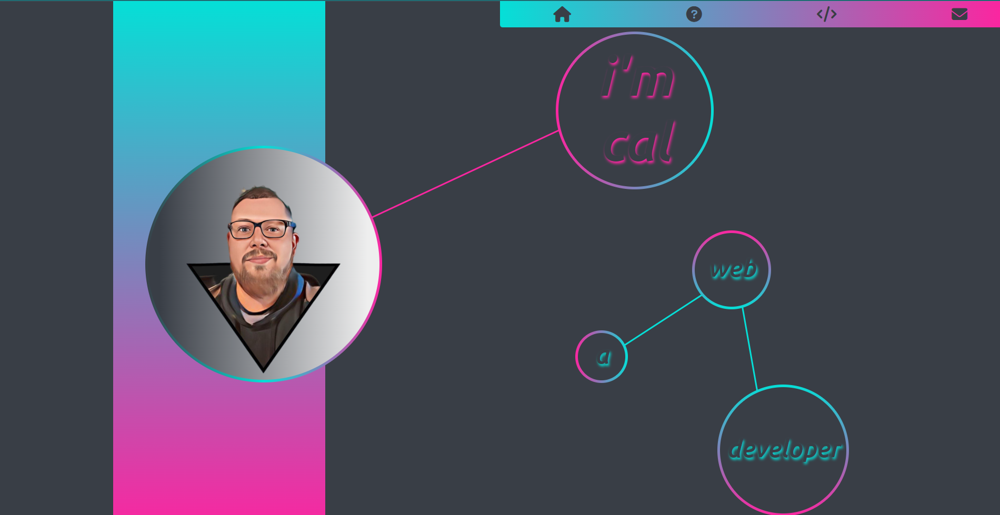

  

  # Coding Portfolio

  ## Description
  Portfolio showcasing my projects.

  ## Instructions
  No installation required.

  ## Usage
  Users can visit my portfolio page, view my projects and message me to ask questions or make comments.
   
  [Link to my Portfolio Page](https://cpaschall.github.io/portfolio-v3/)
   
  

  ## Contributing
  Not applicaple for this repo :) .

  ## Tests
  none

  ## Questions
  Github: [cpaschall](https://github.com/cpaschall)
   
  Email: cpaschall216@gmail.com

  ---

  [License: Apache 2.0](https://opensource.org/licenses/Apache-2.0)
 
  